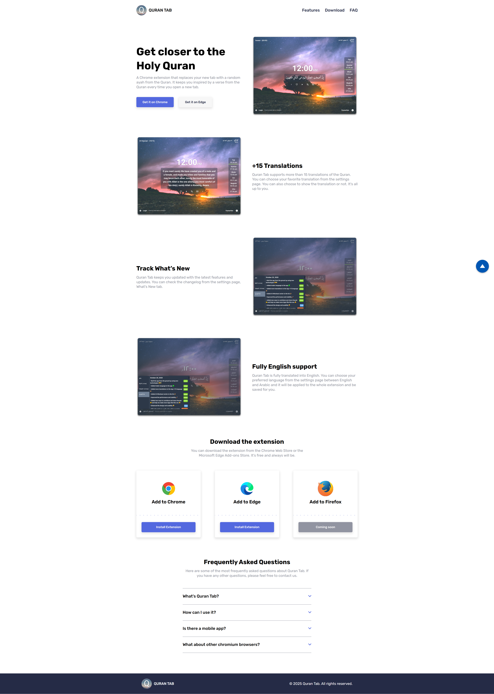
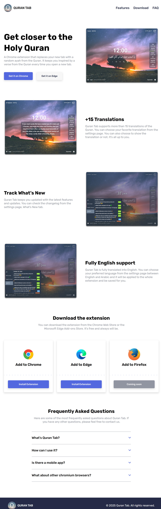

# 🌙 Quran Tab Landing Page

A simple and responsive landing page for the **Quran Tab Chrome Extension**, built with **HTML**, **CSS**, and **Sass**.

---

## 🌐 Live Demo  
Check out the live version of the project here: 

👉 [Quran Tab Landing Page](https://nabil-hany22.github.io/Quran-Tab-Landing-Page/)

---

## 📸 Preview

<p align="center">
  
  
</p>

<p align="center">
  
</p>

---

## 🛠️ Tech Stack

- **HTML5**
- **CSS3**
- **Sass**

---

## 🚀 Features

- 📖 Clean and modern design.  
- 📱 Fully responsive (Desktop, Tablet, Mobile).  
- ⚡ Lightweight and fast loading.  
- 🎨 Styled with Sass for better code structure.  

---

## 📂 Project Structure

```bash
Quran-Tab-Landing-Page/
│── images/         # Project images, icons
│
│── preview/        # Preview screenshots (desktop, tablet, mobile)
│
│── styles/              # SCSS & CSS files
│   ├── style.css
│   ├── style.css.map
│   └── style.scss
│
│── index.html      # Main HTML file
│── README.md       # Project documentation
```

---

## 📬 Connect with Me

👤 **Nabil Hany**  
- GitHub: [Nabil-Hany22](https://github.com/Nabil-Hany22)  
- LinkedIn: [Nabil El-Amrawy](https://www.linkedin.com/in/nabil-el-amrawy/)  

---

💡 *Feel free to check out the live demo and share your feedback!*  
